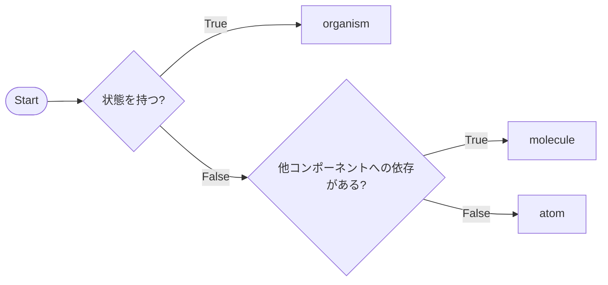
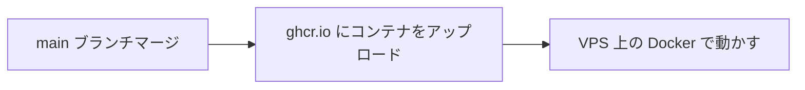

# usuyuki_blog_v2

うすゆきブログ v2

# バックエンド

Ghost

# フロントエンド

Astro

## コンポーネント

```mermaid
flowchart LR
  Start([Start])-->if1{状態を持つ?}
  if1-->|True|organism[organism]
  if1-->|False|if2{他コンポーネントへの依存がある?}
  if2-->|True|molecule[molecule]
  if2-->|False|atom[atom]
```

# デプロイ

```mermaid
graph LR
  A[main ブランチマージ] --> B[ghcr.io にコンテナをアップロード]
  B --> C[VPS 上の Docker で動かす]
```
