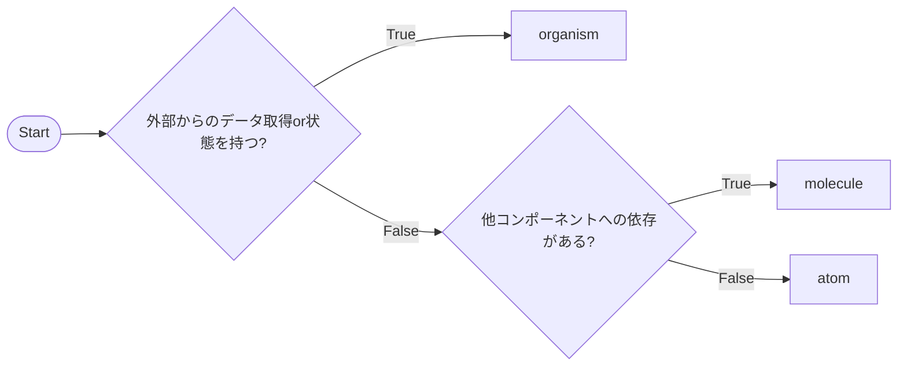
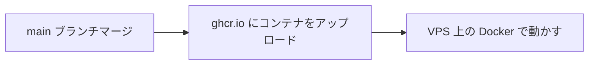

# usuyuki_blog_v2

うすゆきブログ v2

[](https://github.com/usuyuki/usuyuki_blog_v2/actions/workflows/label.yml)

[](https://github.com/usuyuki/usuyuki_blog_v2/actions/workflows/staticAnalysis.yml)

[](https://github.com/usuyuki/usuyuki_blog_v2/actions/workflows/lint.yml)

[](https://github.com/usuyuki/usuyuki_blog_v2/actions/workflows/deploy.yml)

# バックエンド

Ghost CMS 6（ヘッドレス）

# フロントエンド

Astro 5 + Tailwind CSS 4 + Svelte 5

## 記事ソース

Ghost 記事に加えて、外部サービスの記事をまとめて表示できます。

| サービス | 取得方式 | 設定キー |
|---------|---------|---------|
| Qiita | API v2（全記事・ページネーション対応） | `qiitaUserId` |
| Zenn | RSS | `rssUrl` |
| note | RSS | `rssUrl` |

`EXTERNAL_BLOGS` 環境変数で設定します：

```json
[
  {"name": "Qiita", "qiitaUserId": "username", "color": "#55c500"},
  {"name": "Zenn",  "rssUrl": "https://zenn.dev/username/feed", "color": "#3ea8ff"}
]
```

## コンポーネント



# デプロイ


